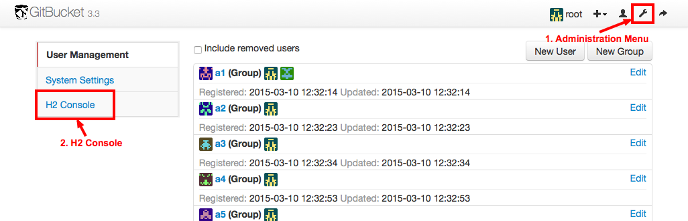
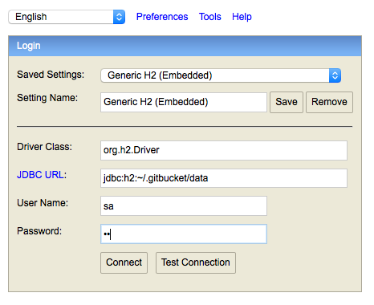

You can look data in H2 via H2 Console integrated into GitBucket.

Logged-in to GitBucket with administrator user and click H2 Console from Administration menu.

To connect GitBucket database, input connection information as following:

- Driver Class: org.h2.Driver
- JDBC URL: jdbc:h2:~/.gitbucket/data
- User Name: sa
- Password: sa

