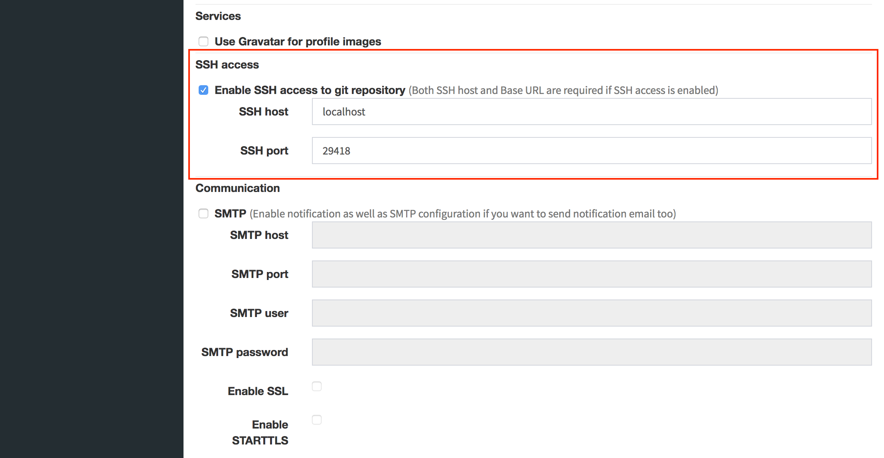

## Configuration

You can enable SSH for Git access at the administration console. A hostname and a port number which are used for SSH access are required.

Also, you have to set the base url of your GitBucket instance.

Then, repository url for SSH becomes available.

## SSH key

Users who want to use SSH for Git access have to register their SSH keys to GitBucket.

> TODO

