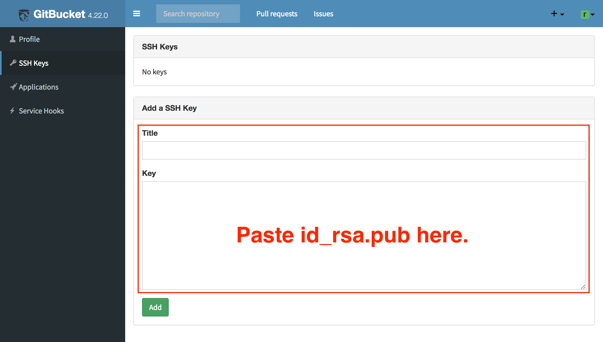

## Configuration

You can enable SSH for Git access at the system settings page. A hostname and a port number which are used for SSH access are required.


Also, you have to set the base url of your GitBucket instance to enable SSH access.


Then, repository url for SSH becomes available.


## SSH key

Users who want to use SSH for Git access have to register their SSH keys to GitBucket.

First, create a key using `ssh-keygen`:

```
$ ssh-keygen -t rsa -b 4096 -C "your_email@example.com"
```

`id_rsa` and `id_rsa.pub` are generated in `~/.ssh`. Then, copy & paste content of `id_rsa.pub` to SSH Keys in the account settings of GitBucket: 



That's all. SSH access is now available.
