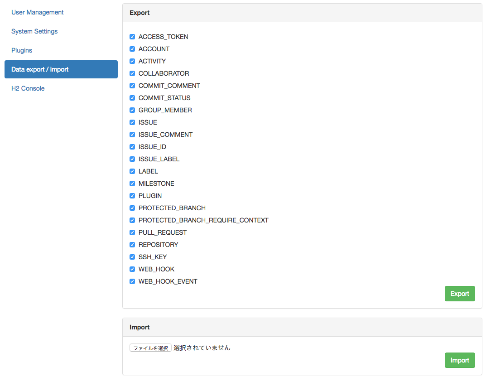

Since 4.0, GitBucket supports MySQL (>= 5.7) and PostgreSQL, not only embedded H2 database.

This feature is still **experimental** in GitBucket 4.0, so try to use as your own risk.

## Configuration

You can configure database connection in `GITBUCKET_HOME/database.conf`:

### H2 (default)

```
db {
  url = "jdbc:h2:${DatabaseHome};MVCC=true"
  user = "sa"
  password = "sa"
}
```

### MySQL 5.7

```
db {
  url = "jdbc:mysql://localhost/gitbucket?useUnicode=true&characterEncoding=utf8"
  user = "test"
  password = "test"
}
```

### PostgreSQL

```
db {
  url = "jdbc:postgresql://localhost/gitbucket"
  user = "test"
  password = "test"
}
```

## Data migration

Since 4.0, GitBucket also provide data exporting and importing.



If you have existing data in embedded H2 database, you can move your data to external database from H2 database by following operation:

1. At first, you must upgrade to GitBucket 3.14 (This is the final version of 3.x series)
2. Then upgrade to GitBucket 4.0
3. Export data as a **XML** file from H2 database at the administration console
  - Exclude tables which is created by plug-ins if these plug-ins does not provide for GitBucket 4.x series. Recommend separate export for plug-in's tables. When 4.x supported version will be released, you can restore their data from the exported files.
4. Setup the external database and update `GITBUCKET_HOME/database.conf` as mentioned above and reboot GitBucket
5. Import an exported XML file into the configured external database at the administration console

You can also export data as SQL file. The administration console on GitBucket does not support import from the SQL file, but you can import it using other database front-end tools or command-line client tools such as `mysql` or `psql` command.

In addition, if you import to **PostgreSQL**, you have to run following SQL after that:

```sql
SELECT setval('label_label_id_seq', (select max(label_id) + 1 from label));
SELECT setval('activity_activity_id_seq', (select max(activity_id) + 1 from activity));
SELECT setval('access_token_access_token_id_seq', (select max(access_token_id) + 1 from access_token));
SELECT setval('commit_comment_comment_id_seq', (select max(comment_id) + 1 from commit_comment));
SELECT setval('commit_status_commit_status_id_seq', (select max(commit_status_id) + 1 from commit_status));
SELECT setval('milestone_milestone_id_seq', (select max(milestone_id) + 1 from milestone));
SELECT setval('issue_comment_comment_id_seq', (select max(comment_id) + 1 from issue_comment));
SELECT setval('ssh_key_ssh_key_id_seq', (select max(ssh_key_id) + 1 from ssh_key));
```

This operation has a risk to break your data by unexpected reason, so we strongly recommend to backup all your data in `GITBUCKET_HOME` before upgrading GitBucket.
